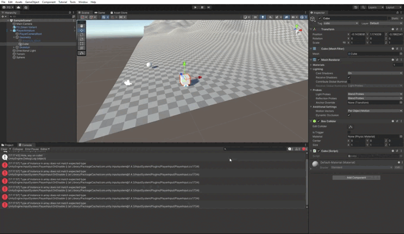

# II-P01-UnityIntroduction

## Resultado final

  

## Descripción del trabajo

En esta práctica intruductoria se pretende tomar contacto con Unity. Para ello, se han añadido una serie de objetos básicos con etiquetas identificativas, se ha importado el asset *Starter Asset - Third Person* y se ha asociado un cubo como geometría de un controlador de dicho asset para que este se mueva. Por otro lado, se ha creado un terreno con unas montañas al fondo de la escena y se ha añadido una nave espacial perteneciente a un asset externo a los "Starter Assets". Por último, cada objeto básico añadido tiene un script donde imprime por consola que ha sido utilizado.  

## Enlaces consultados

[Vídeo sobre el terreno](https://www.youtube.com/watch?v=z2h7E_Yx_Ow)  

[Asset usado que no pertenece a los Starter Assets](https://assetstore.unity.com/packages/3d/vehicles/space/federation-corvette-f3-79860)
